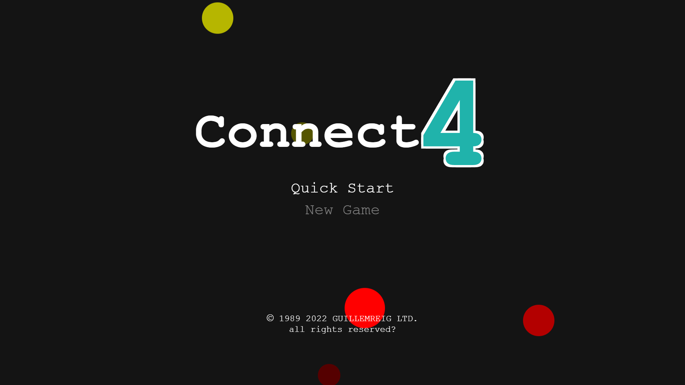
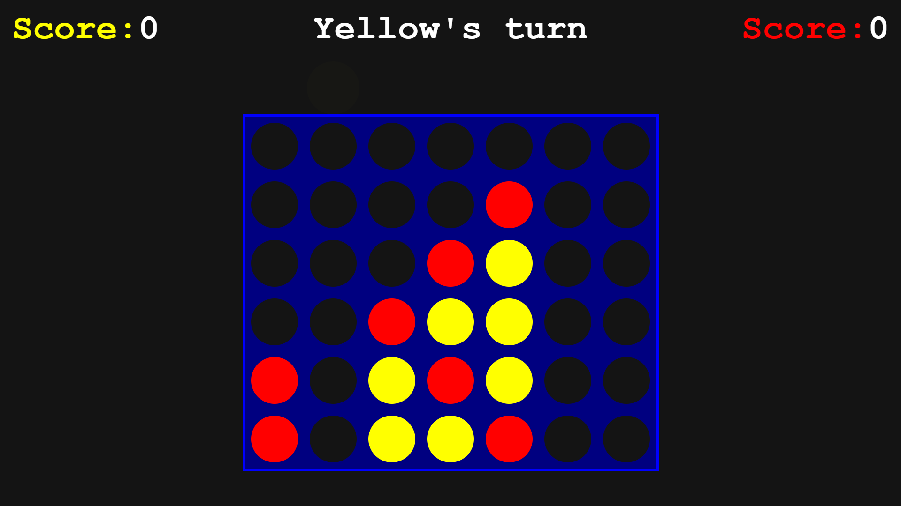

# Connect 4

**Live app:** https://reiggrau.github.io/connect_4/



## Introduction

A fully playable, browser-based Connect 4 game built as my very first web development project. What started as a simple exercise quickly grew into a polished arcade experience — complete with animated menus, a parallax coin-rain effect, keyboard and mouse controls, three music tracks, and sound effects. It was built in a matter of days and significantly exceeded what was expected at that stage of learning.

## Setup

No build step or dependencies required. The app runs directly in the browser.

**Option A — open directly:**

Just double-click `index.html`, or drag it into any modern browser.

**Option B — local dev server (recommended, avoids audio autoplay restrictions):**

```bash
npx serve .
```

Then open the URL shown in the terminal (usually `http://localhost:3000`).

## Stack

| Layer       | Technology                                    |
| ----------- | --------------------------------------------- |
| Markup      | HTML5                                         |
| Styling     | CSS3 (Grid, Flexbox, `@keyframes` animations) |
| Logic       | Vanilla JavaScript (`var`-era)                |
| DOM helpers | jQuery 3.6.1 (via CDN)                        |
| Audio       | HTML5 `<audio>`                               |
| Hosting     | GitHub Pages                                  |

No frameworks, no bundler, no build pipeline — just the raw fundamentals.

## How It Works

### Board representation

Rather than storing a 2D array in JavaScript, the board's spatial relationships are encoded directly in the HTML via CSS classes. Every cell is tagged with its column (`col0`–`col6`), row (`row0`–`row5`), forward diagonal (`dia0`–`dia5`), and back diagonal (`dib0`–`dib5`).

### Win detection

After each move, the game reads the classes of the newly placed cell, uses jQuery to select all cells sharing each direction class, and counts consecutive cells belonging to the current player. If any line reaches 4, those cells are flagged with a pulsing animation and the win screen is shown.

### Coin drop animation

The selection coin is a real DOM element that physically translates downward using a CSS `transform: translateY()` transition, with duration scaled to the drop height. Input is disabled for the duration of the transition and re-enabled on `transitionend` — preventing move-stacking bugs.

### Menu system

All screens are stacked in the DOM and toggled with `visibility` + `height`. Menu state is tracked with two integers (`idiv` for the current screen, `ibtn` for the selected button), allowing full keyboard navigation via Arrow keys and Space/Enter — in addition to mouse clicks.

### Coin rain

Three layers of coins (large, medium, small at different speeds and z-indices) are randomly dropped on `setTimeout` loops, creating a parallax depth effect on the menu and victory screens.

## Features

- Arcade-style boot screen with a "Press Start" prompt
- Animated logo with a 20-second rainbow colour cycle
- Full keyboard navigation (arrows + space/enter) across menus and gameplay
- Mouse support — hover to aim, click to drop
- Coin physics — drop animation scaled to fall height
- Parallax coin rain on menu and victory screens
- Three 8-bit music tracks (menu, gameplay, victory) with sound effects
- Persistent score tracking across rematches
- Winning coins highlighted with a pulsing animation

## Screenshots



## Notes

The "1 vs AI" mode is scaffolded but not yet implemented — the board and game logic are fully ready for it.
